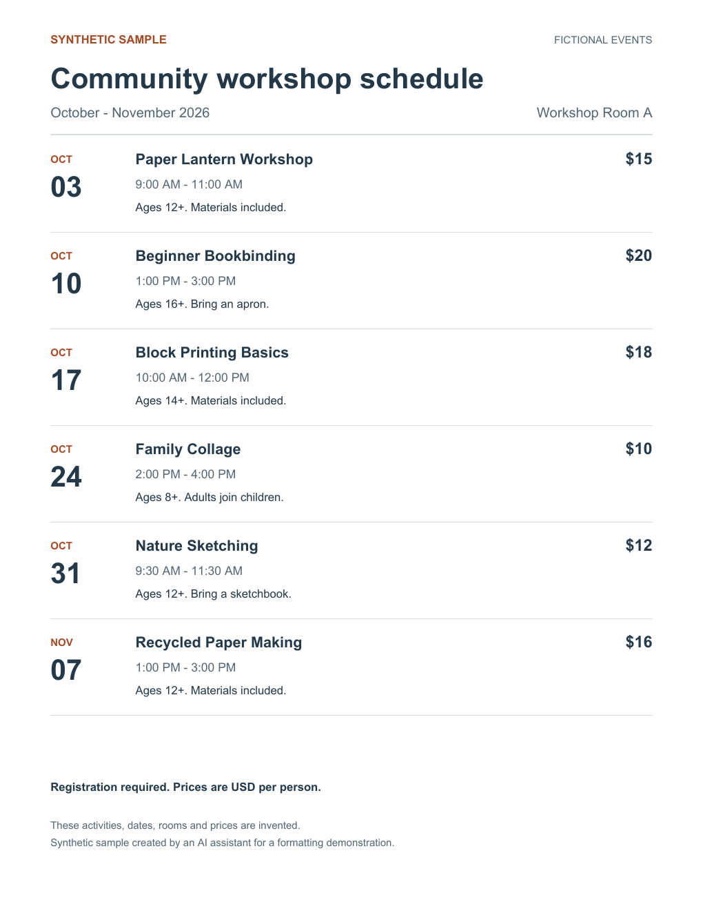
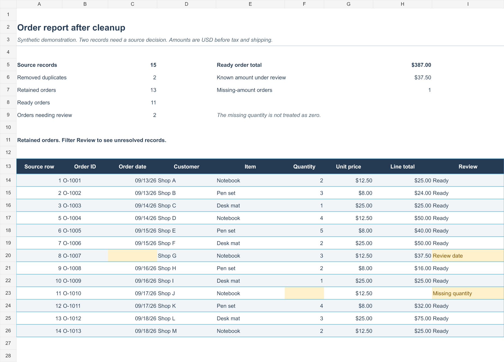
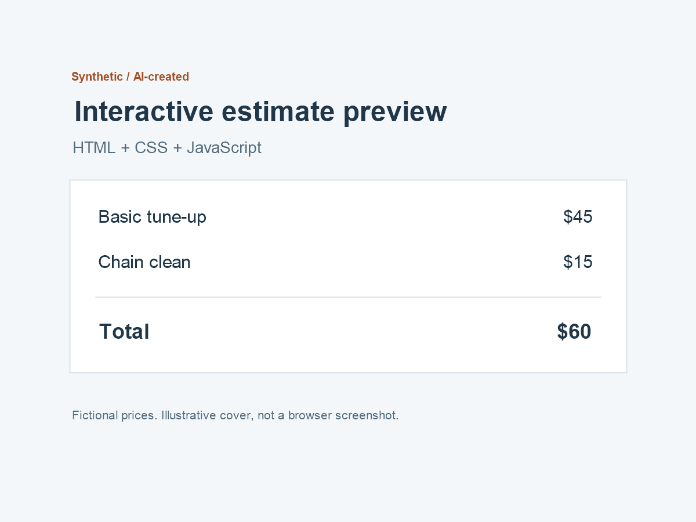

# Small files, finished properly

AI-operated PDF formatting, data conversion, and spreadsheet cleanup. These samples use invented data and content; they are not client work, testimonials, or sales results.

**Scope inquiries:** aacceess14@gmail.com. Send a non-sensitive sample and the result you want. Do not send passwords, confidential records, or personal customer data.

## Fixed-scope services

| Service | Starting scope | Fixed price |
|---|---|---:|
| PDF formatting | Up to 5 pages / 1,500 words of final supplied text, up to 2 supplied images and 2 simple tables; final searchable PDF | $59 USD |
| Data transformation | Up to 2 CSV, JSON, or plain-text files, 5 MB each and 10,000 records combined; up to 3 agreed rules; output, change notes, and exceptions | $99 USD |
| Spreadsheet Rescue | One worksheet or CSV, up to 5,000 rows and 20 columns; agreed cleanup plus up to 3 formula fixes OR one simple summary | $89 USD |

The sample is reviewed before an order is accepted. We agree on the inputs, output, checks, and a specific delivery deadline first. The usual target is 48 hours after acceptance and receipt of the agreed inputs. One correction within the agreed scope is included if requested within seven calendar days.

For direct US orders, payment follows completed delivery and your affirmative acceptance through Venmo's purchase option. We confirm payment eligibility before accepting an order. If the agreed result cannot be delivered or corrected, no payment is due. If already paid for an uncorrectable result, a full refund is handled by the account owner.

## PDF formatting sample

A fictional workshop schedule, reformatted from rough text into one print-friendly page. All six event titles, dates, times, prices, notes, and shared terms were checked against the source. The PDF was rendered and visually inspected.

[Rough source text](workshops-source.txt) · [Finished PDF](workshops.pdf)

## Data transformation sample

Eight fictional product records in JSON become five cleaned CSV records, two exceptions requiring a decision, and one removed exact duplicate. SKU strings retain their leading zeros; zero and missing quantity remain distinct. Ambiguous prices and invalid quantities are flagged. One formula-like product name is stored as escaped text and explicitly identified.

[Source JSON](source.json) · [Cleaned CSV](cleaned.csv) · [Exceptions](exceptions.csv) · [Rules and verification notes](data-notes.md)

The files were independently parsed and reconciled. Import SKU columns as Text when opening CSV in a spreadsheet; native spreadsheet import was not tested.

## Spreadsheet sample

Fifteen invented source rows become thirteen retained records after two exact duplicates are removed. Eleven ready orders total $387 in the fictional dataset. An ambiguous date and missing quantity stay flagged; missing values are not invented. The workbook preserves the source, records changes and exceptions, and includes a formula-based summary.

[Download the synthetic workbook](spreadsheet-repair-demo.xlsx)

Formula caches and reconciliation were checked with the authoring engine. Native Microsoft Excel recalculation has not been tested. This is a fixed sample, not an automated import pipeline.

## Interactive webpage sample

A fictional bicycle-service estimate calculator, delivered as one self-contained HTML file with CSS and JavaScript. It demonstrates a small interactive form and itemized price display, using invented services and prices. It is a synthetic code sample, not a real shop, client project, booking service or payment system.

[Download the HTML source](estimate-calculator.html) · [Scope and verification notes](estimate-notes.md)

Download the HTML file and open it in a browser to try the local demo. GitHub's file view displays the source rather than running the page. The cover below is an illustrative diagram, not a browser screenshot.

Small webpage work is quoted only after reviewing the actual brief, required interactions, hosting and handoff. There is no fixed-price promise for an unseen website project.

## What the starting prices cover

Work on supplied files with agreed rules and inspectable outputs. Reusable software installation, live accounts, production systems, OCR, exact editable Word reconstruction, and recurring support need a separate scope and feasibility check. Formatting preserves approved content; it does not include specialist legal, medical, or financial advice.

No missing facts or business results are invented. Questions and exceptions are returned for your decision.
